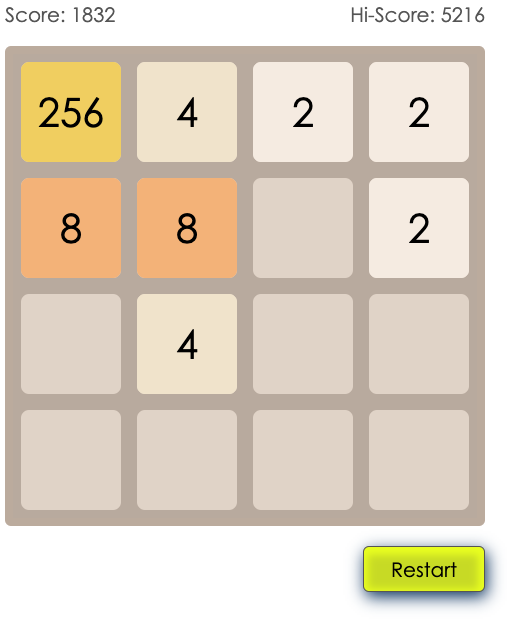

# 2048 Game - React

This is my first ReactJS project and took a couple of days to code while reading the basic of React during development.

In the project directory, you can run:

### `npm start`

Runs the app in the development mode.\
Open [http://localhost:3000](http://localhost:3000) to view it in the browser.
